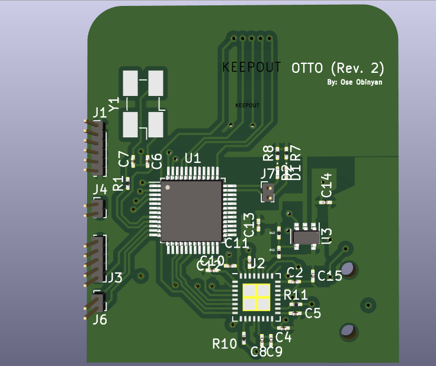
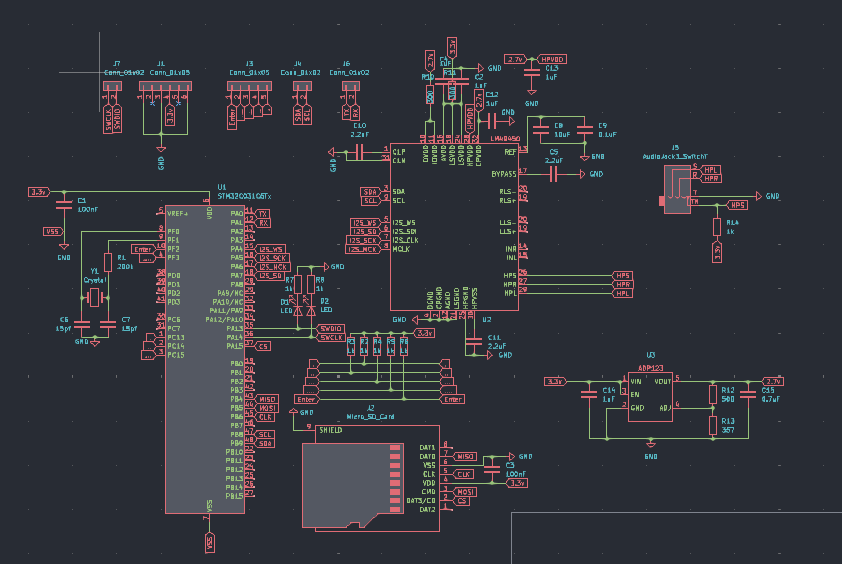

# OTTO

A MP3 Player design I came up with about a year ago, the theroy behind it's design works as the following. The STM32C031C6T6 would interface the SD card through an SPI, stream Encodded audio data to the microcontroller, there it would be decoded into PCM samples, those samples would then be streamed to the LM49450, there it would be converted into analog audio signals which will be sent to speakers.

This project has no real hardware prototype but the design is here and can be revised if I ever feel like returning to this project. The firmware folder holds a software prototype for MP3 decodeding. A project that has proven to be very difficult. I would like to come back to this project in the future and come at with some new ideas. However, due to the fact that testing hardware like this would be very costly and difficult for me at the moment. But all the project files are in this repository for better storage in the future.
