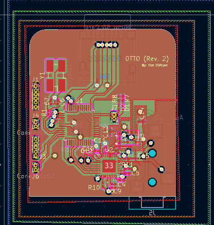

# OTTO

A MP3 Player design I came up with about a year ago, the theroy behind it's design works as the following. The STM32C031C6T6 would interface the SD card through an SPI, stream Encodded audio data to the microcontroller, there it would be decoded into PCM samples, those samples would then be streamed to the LM49450, there it would be converted into analog audio signals which will be sent to speakers.

